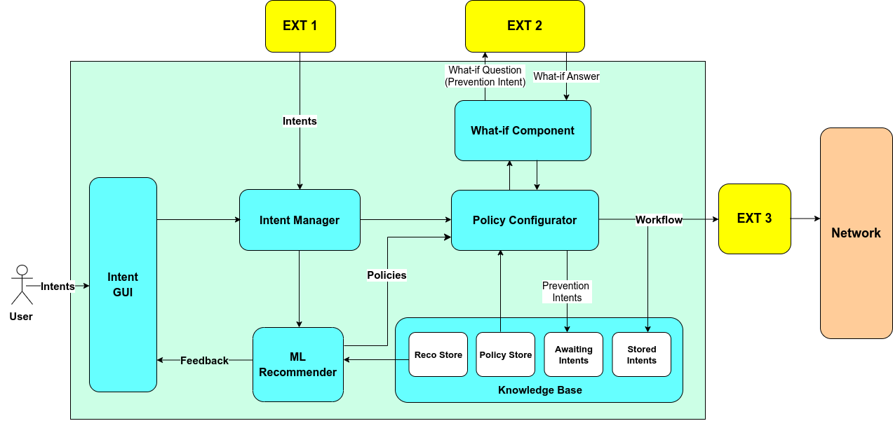

# Intent-Based Networking Interface

The IBI is a software developed within the scope of a project on Intent-based Network Security. The main goal of the module is to match intents that 
represent the desired state of the system or network and apply policies to 
achieve those states or, in other words, to fulfill the intents. Currently, the 
IBI can receive intents encoded as JSON files through a RESTful API or put in natural language through a 
graphical user interface (GUI) and translate these natural language intents into JSON formats using Large Language Model (LLM). It receives security intents that could be 
mitigation or prevention intents regarding threats affecting the network. Within 
the IBI, the intents are processed and matched with the policies that are sent 
to another module within the project. This other module needs to be up and running for the IBI to function.
The IBI also has an ML Recommender based on Reinforcement Learning that recommends policies based on their previous performances.
The network topology and other important details are contained in the config.yml file.


## Installation

- Download the application code:
    ```
    git clone https://github.com/tissadeking/ibi.git
    ```
- Change the current directory to ibi.
    ```
    cd ibi

- Build and run the software as Docker container:
    ```
    sudo docker build -t ibi .
    sudo docker run --network host ibi
    ```
## Accessing the service
- The API is available at http://172.21.0.1, on port 7777.
- The ElasticSearch Instance is exposed at port 9200, also at http://172.21.0.1.
- The IP at which the software and ElasticSearch run can be changed in the config.yml file.
- The entire API endpoints to access stored intents, etc are contained in the config.yml file.

## Software Architecture


## Workflows Description
- There are two ways through which intents can be received by the IBI. They are through the Intent GUI in natural language, and from the external module 1 - EXT 1 in JSON format. The natural language intent is translated to structured format by an LLM which is used by the Intent Manager, however the intent received from EXT 1 which is already in structured format is not translated further. An intent can be either a Quality-of-Service (QoS) or a security intent. A QoS intent specifies operating conditions of the network that should never be violated. An example is 'the connection between dns-client 1 and dns-client 2 must remain available'. In this case, no security intent deployed on any of the hosts in the QoS intent should contradict with the QoS intent. A security intent can be either a prevention or a mitigation intent.
- When a prevention intent is sent to the Policy Configurator by the Intent Manager, the Policy Configurator matches the intent with the available policies in the Policy Store to be able to generate a suitable policy that should be deployed as a workflow in the network. But before it does that, it first sends this prevention policy to the What-if Component which generates a What-if Question and sends same to the EXT 2. The EXT 2 is an external module that makes of use digital twin to test the prevention policy received from the What-if Component and predict its impact on the network. When the Policy Configurator sends a prevention policy to the What-if Component, the Policy Configurator also stores these prevention intents/policies in the Awaiting Intents Store since it awaits a What-if Answer from the What-if Component regarding the policy. The What-if Component receives What-if Answer from EXT 2 and processes it. If it's acceptable then it sends it to the Policy Configurator which in turn completes it and sends as workflow to EXT 3 while storing it inside the Stored Intents Store. EXT 3 is the external module that is responsible for deploying workflows in the network.
- When a mitigation intent is sent to the Policy Configurator by the Intent Manager, the Policy Configurator matches the intent with the available policies in the Policy Store to be able to generate a suitable policy that should be deployed as a workflow in the network. It goes ahead and sends this workflow to the EXT 3 for deployment in the network and stores it also in the Stored Intents Store without any What-if Processes.
- The ML Recommender based on Q-learning - a reinforcement learning method also receives intents and recommends policies based on performances of previous policies evaluated from the results of their implementation which are stored in the Reco Store. The ML Recommender rewards policies based on their performances noticed at the end of their implementation, and uses these rewards to make decisions next time. With the exploration probability parameter, the software decides when to use the ML Recommender or Policy Configurator to generate policy.
